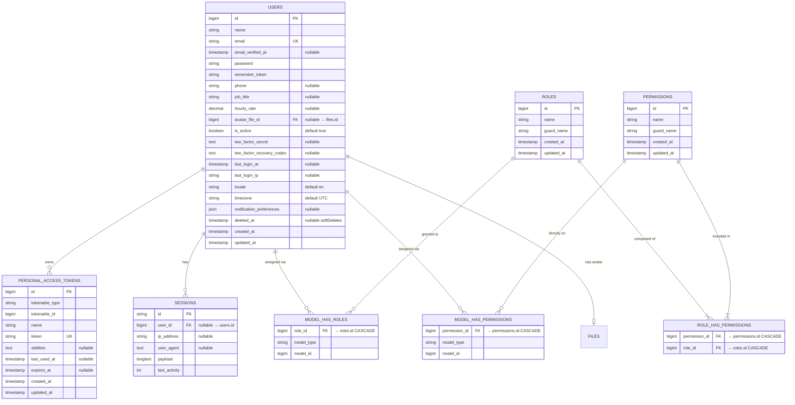
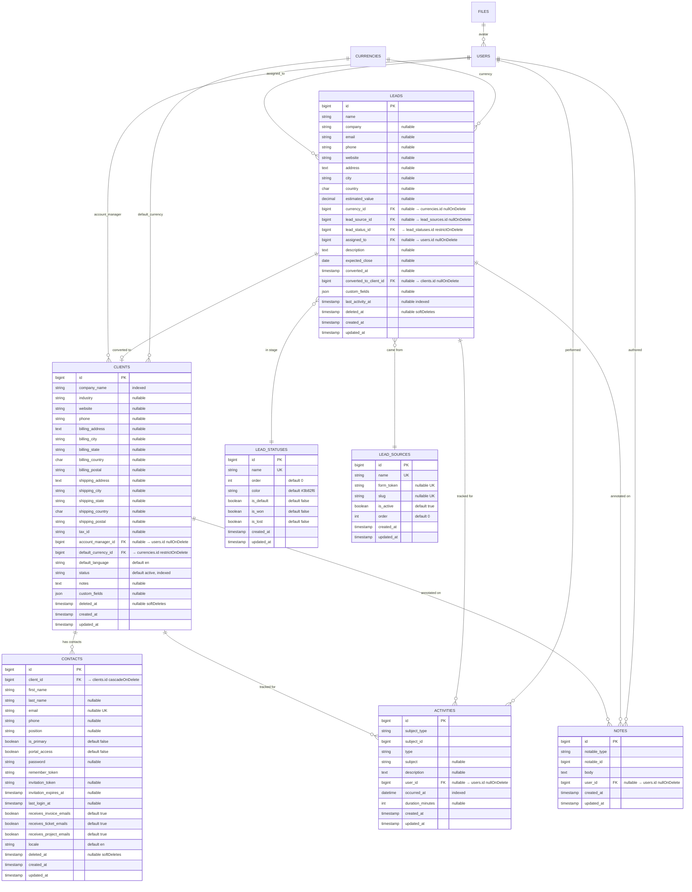
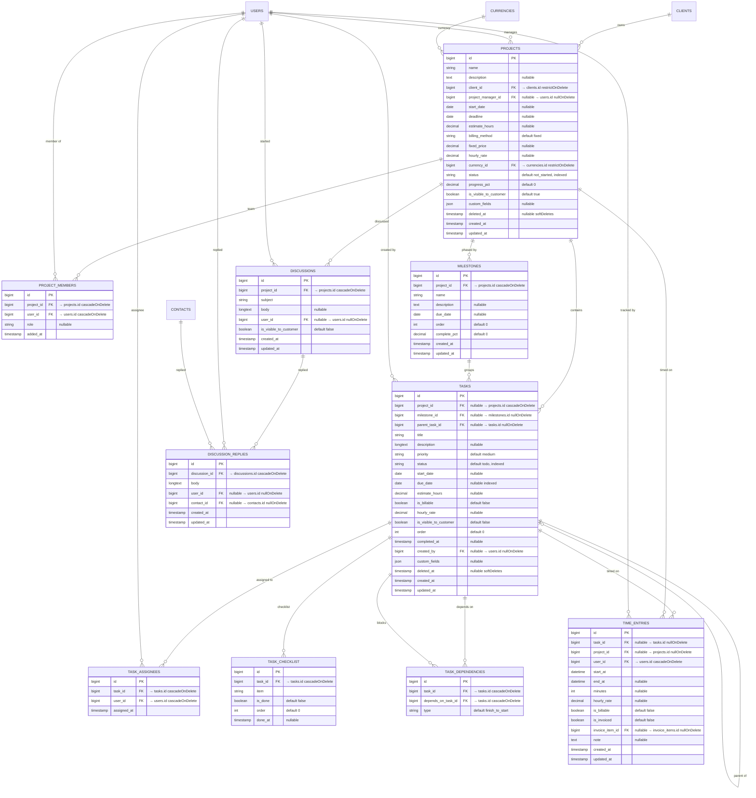
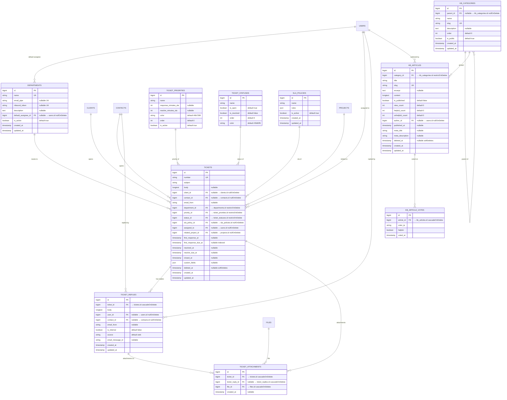
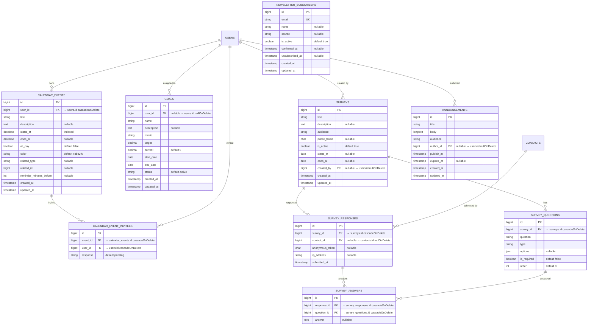
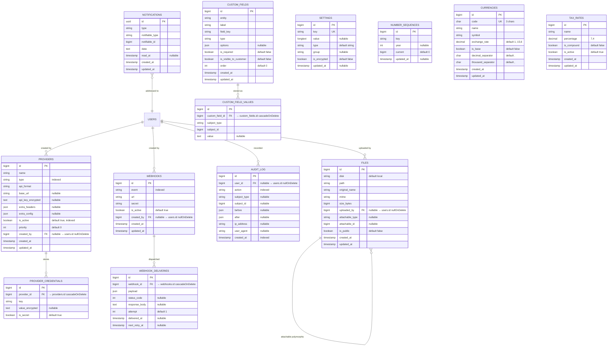

```mermaid
flowchart TB
    subgraph IDENTITY [IDENTITY — Users & RBAC]
        direction LR
        Users[users]
        Roles[roles]
        Perms[permissions]
        role_has_permissions
        model_has_roles
        model_has_permissions
        PAT[personal_access_tokens]
        Sessions[sessions]
        PWRT[password_reset_tokens]
    end

    subgraph CRM [CRM — Clients & Leads]
        direction LR
        Clients[clients]
        Contacts[contacts]
        Leads[leads]
        LeadSources[lead_sources]
        LeadStatuses[lead_statuses]
        Activities[activities]
        Notes[notes]
    end

    subgraph SALES [SALES — Estimates → Invoices]
        direction LR
        Estimates[estimates]
        EstimateItems[estimate_items]
        Proposals[proposals]
        Contracts[contracts]
        Invoices[invoices]
        InvoiceItems[invoice_items]
        Payments[payments]
        CreditNotes[credit_notes]
        CreditNoteInv[credit_note_invoices]
        Items[items]
        Expenses[expenses]
        ExpenseCats[expense_categories]
    end

    subgraph PROJECTS [PROJECTS — Planning & Tasks]
        direction LR
        Projects[projects]
        ProjectMembers[project_members]
        Milestones[milestones]
        Tasks[tasks]
        TaskAssignees[task_assignees]
        TaskCL[task_checklist]
        TaskDeps[task_dependencies]
        TimeEntries[time_entries]
        Discussions[discussions]
        DiscReplies[discussion_replies]
    end

    subgraph SUPPORT [SUPPORT — Tickets & KB]
        direction LR
        Departments[departments]
        Tickets[tickets]
        TicketReplies[ticket_replies]
        TicketAtts[ticket_attachments]
        TicketPrio[ticket_priorities]
        TicketStatus[ticket_statuses]
        SLAPolicies[sla_policies]
        KBCats[kb_categories]
        KBArticles[kb_articles]
        KBVotes[kb_article_votes]
    end

    subgraph ENGAGE [ENGAGEMENT — Calendar, Goals, Surveys]
        direction LR
        CalendarEvents[calendar_events]
        CalendarInvitees[calendar_event_invitees]
        Goals[goals]
        Surveys[surveys]
        SurveyQ[survey_questions]
        SurveyR[survey_responses]
        SurveyA[survey_answers]
        Announcements[announcements]
        NewsSubs[newsletter_subscribers]
    end

    subgraph PLATFORM [PLATFORM — Cross-Cutting]
        direction LR
        Providers[providers]
        ProvCreds[provider_credentials]
        Webhooks[webhooks]
        WebhookDel[webhook_deliveries]
        CustomFields[custom_fields]
        CFValues[custom_field_values]
        AuditLog[audit_log]
        Settings[settings]
        NumSeq[number_sequences]
        Notifications[notifications]
        Files[files]
        Currencies[currencies]
        TaxRates[tax_rates]
    end

    CRM --> SALES
    CRM --> PROJECTS
    CRM --> SUPPORT
    CRM --> ENGAGE
    SALES --> PROJECTS
    PLATFORM -.- IDENTITY
    PLATFORM -.- CRM
    PLATFORM -.- SALES
    PLATFORM -.- PROJECTS
    PLATFORM -.- SUPPORT
    PLATFORM -.- ENGAGE
```

# 02 — Entity Relationship Diagram

**Project:** crmoffice
**Last updated:** 2026-05-30

This document presents the ERD via Mermaid, generated from the actual 63 migration files. Render with any Mermaid-compatible viewer (GitHub, VS Code Mermaid plugin, mermaid.live). Full DDL specification → [04-DATABASE-SCHEMA.md](./04-DATABASE-SCHEMA.md).

---

## 1. Domain Map (Bird's-Eye View)

```
IDENTITY: users, roles, permissions, role_has_permissions, model_has_roles, model_has_permissions, personal_access_tokens, sessions, password_reset_tokens
CRM:      clients, contacts, leads, lead_sources, lead_statuses, activities, notes
SALES:    estimates, estimate_items, proposals, contracts, invoices, invoice_items, payments, credit_notes, credit_note_invoices, items, expenses, expense_categories
PROJECTS: projects, project_members, milestones, tasks, task_assignees, task_checklist, task_dependencies, time_entries, discussions, discussion_replies
SUPPORT:  departments, tickets, ticket_replies, ticket_attachments, ticket_priorities, ticket_statuses, sla_policies, kb_categories, kb_articles, kb_article_votes
ENGAGE:   calendar_events, calendar_event_invitees, goals, surveys, survey_questions, survey_responses, survey_answers, announcements, newsletter_subscribers
PLATFORM: providers, provider_credentials, webhooks, webhook_deliveries, custom_fields, custom_field_values, audit_log, settings, number_sequences, notifications, files, currencies, tax_rates
```



---

## 2. Identity & RBAC ERD



---

## 3. Core CRM ERD



---

## 4. Sales ERD

```mermaid
erDiagram
    CLIENTS ||--o{ ESTIMATES : "billed to"
    CLIENTS ||--o{ PROPOSALS : "addressed to"
    CLIENTS ||--o{ CONTRACTS : "contracted with"
    CLIENTS ||--o{ INVOICES : "billed to"
    CLIENTS ||--o{ CREDIT_NOTES : "credited to"
    CLIENTS ||--o{ EXPENSES : "incurred for"
    PROPOSALS ||--o| LEADS : "based on"
    ESTIMATES ||--o{ ESTIMATE_ITEMS : "contains"
    ESTIMATES ||--o| INVOICES : "converted to"
    INVOICES ||--o{ INVOICE_ITEMS : "contains"
    INVOICES ||--o{ PAYMENTS : "paid by"
    INVOICES ||--o{ CREDIT_NOTE_INVOICES : "credited by"
    CREDIT_NOTES ||--o{ CREDIT_NOTE_INVOICES : "applied to"
    INVOICES ||--o{ INVOICES : "recurring child"
    PROJECTS ||--o{ INVOICES : "billed for"
    PROJECTS ||--o{ EXPENSES : "incurred for"
    ITEMS ||--o{ ESTIMATE_ITEMS : "templated by"
    ITEMS ||--o{ INVOICE_ITEMS : "templated by"
    TAX_RATES ||--o{ ITEMS : "default tax"
    TAX_RATES ||--o{ ESTIMATE_ITEMS : "tax"
    TAX_RATES ||--o{ INVOICE_ITEMS : "tax"
    TAX_RATES ||--o{ EXPENSES : "tax"
    CURRENCIES ||--o{ ITEMS : "currency"
    CURRENCIES ||--o{ ESTIMATES : "denominated in"
    CURRENCIES ||--o{ PROPOSALS : "denominated in"
    CURRENCIES ||--o{ CONTRACTS : "denominated in"
    CURRENCIES ||--o{ INVOICES : "denominated in"
    CURRENCIES ||--o{ PAYMENTS : "denominated in"
    CURRENCIES ||--o{ CREDIT_NOTES : "denominated in"
    CURRENCIES ||--o{ EXPENSES : "denominated in"
    EXPENSE_CATEGORIES ||--o{ EXPENSES : "categorizes"
    TIME_ENTRIES ||--o{ INVOICE_ITEMS : "billed as"
    EXPENSES ||--o{ INVOICE_ITEMS : "billed as"
    USERS ||--o{ ESTIMATES : "created by"
    USERS ||--o{ PROPOSALS : "created by"
    USERS ||--o{ CONTRACTS : "created by"
    USERS ||--o{ INVOICES : "created by"
    USERS ||--o{ CREDIT_NOTES : "created by"
    USERS ||--o{ EXPENSES : "created by"
    PROVIDERS ||--o{ PAYMENTS : "processed via"
    FILES ||--o{ INVOICES : "pdf file"
    FILES ||--o{ EXPENSES : "receipt"

    ESTIMATES {
        bigint id PK
        string number UK
        bigint client_id FK "→ clients.id restrictOnDelete"
        date estimate_date
        date expiry_date "nullable"
        bigint currency_id FK "→ currencies.id restrictOnDelete"
        decimal subtotal "default 0"
        decimal discount_total "default 0"
        decimal tax_total "default 0"
        decimal total "default 0"
        string status "default draft, indexed"
        text notes "nullable"
        text terms "nullable"
        char public_token UK
        bigint converted_invoice_id FK "nullable → invoices.id nullOnDelete"
        bigint created_by FK "nullable → users.id nullOnDelete"
        timestamp deleted_at "nullable softDeletes"
        timestamp created_at
        timestamp updated_at
    }

    ESTIMATE_ITEMS {
        bigint id PK
        bigint estimate_id FK "→ estimates.id cascadeOnDelete"
        bigint item_id FK "nullable → items.id nullOnDelete"
        text description
        decimal quantity "default 1"
        decimal unit_price
        bigint tax_rate_id FK "nullable → tax_rates.id nullOnDelete"
        decimal discount_pct "default 0"
        decimal line_total
        int order "default 0"
    }

    PROPOSALS {
        bigint id PK
        string number UK
        string subject
        bigint client_id FK "nullable → clients.id nullOnDelete"
        bigint lead_id FK "nullable → leads.id nullOnDelete"
        longtext content
        decimal total "default 0"
        bigint currency_id FK "→ currencies.id restrictOnDelete"
        date open_until "nullable"
        string status "default draft"
        char public_token UK
        datetime accepted_at "nullable"
        string accepted_by_name "nullable"
        text accepted_signature "nullable"
        string accepted_ip "nullable"
        datetime declined_at "nullable"
        text decline_reason "nullable"
        bigint created_by FK "nullable → users.id nullOnDelete"
        timestamp deleted_at "nullable softDeletes"
        timestamp created_at
        timestamp updated_at
    }

    CONTRACTS {
        bigint id PK
        string number UK
        string subject
        bigint client_id FK "→ clients.id restrictOnDelete"
        longtext content
        date start_date
        date end_date "nullable"
        decimal contract_value "nullable"
        bigint currency_id FK "→ currencies.id restrictOnDelete"
        string status "default draft"
        char public_token UK
        datetime signed_at "nullable"
        string signed_by_name "nullable"
        text signed_signature "nullable"
        string signed_ip "nullable"
        int notify_expiry_days_before "default 14"
        bigint created_by FK "nullable → users.id nullOnDelete"
        timestamp deleted_at "nullable softDeletes"
        timestamp created_at
        timestamp updated_at
    }

    INVOICES {
        bigint id PK
        string number UK
        bigint client_id FK "→ clients.id restrictOnDelete"
        bigint project_id FK "nullable → projects.id nullOnDelete"
        bigint estimate_id FK "nullable → estimates.id nullOnDelete"
        bigint recurring_parent_id FK "nullable → invoices.id nullOnDelete"
        date invoice_date
        date due_date "indexed"
        bigint currency_id FK "→ currencies.id restrictOnDelete"
        decimal subtotal "default 0"
        decimal discount_total "default 0"
        decimal tax_total "default 0"
        decimal total "default 0"
        decimal paid_total "default 0"
        decimal balance_due "default 0"
        string status "default draft, indexed"
        boolean is_recurring "default false"
        string recurring_period "nullable"
        int recurring_count "nullable"
        int recurring_remaining "nullable"
        date next_recurring_date "nullable indexed"
        text notes "nullable"
        text terms "nullable"
        char public_token UK
        bigint pdf_file_id FK "nullable → files.id nullOnDelete"
        timestamp sent_at "nullable"
        timestamp viewed_at "nullable"
        bigint created_by FK "nullable → users.id nullOnDelete"
        timestamp deleted_at "nullable softDeletes"
        timestamp created_at
        timestamp updated_at
    }

    INVOICE_ITEMS {
        bigint id PK
        bigint invoice_id FK "→ invoices.id cascadeOnDelete"
        bigint item_id FK "nullable → items.id nullOnDelete"
        bigint time_entry_id FK "nullable → time_entries.id nullOnDelete"
        bigint expense_id FK "nullable → expenses.id nullOnDelete"
        text description
        decimal quantity "default 1"
        decimal unit_price
        bigint tax_rate_id FK "nullable → tax_rates.id nullOnDelete"
        decimal discount_pct "default 0"
        decimal line_total
        int order "default 0"
    }

    PAYMENTS {
        bigint id PK
        bigint invoice_id FK "→ invoices.id restrictOnDelete"
        decimal amount
        bigint currency_id FK "→ currencies.id restrictOnDelete"
        string method
        bigint provider_id FK "nullable → providers.id nullOnDelete"
        string transaction_id "nullable indexed"
        datetime paid_at
        text note "nullable"
        string status "default completed"
        json raw_payload "nullable"
        timestamp created_at
        timestamp updated_at
    }

    CREDIT_NOTES {
        bigint id PK
        string number UK
        bigint client_id FK "→ clients.id restrictOnDelete"
        date issue_date
        decimal total
        decimal applied_total "default 0"
        decimal refunded_total "default 0"
        bigint currency_id FK "→ currencies.id restrictOnDelete"
        string status "default open"
        text reason "nullable"
        bigint created_by FK "nullable → users.id nullOnDelete"
        timestamp created_at
        timestamp updated_at
    }

    CREDIT_NOTE_INVOICES {
        bigint id PK
        bigint credit_note_id FK "→ credit_notes.id cascadeOnDelete"
        bigint invoice_id FK "→ invoices.id cascadeOnDelete"
        decimal amount_applied
        timestamp applied_at
    }

    ITEMS {
        bigint id PK
        string name
        text description "nullable"
        decimal default_price "default 0"
        bigint default_tax_rate_id FK "nullable → tax_rates.id nullOnDelete"
        bigint currency_id FK "nullable → currencies.id nullOnDelete"
        string unit "nullable"
        string sku "nullable indexed"
        boolean is_active "default true"
        timestamp created_at
        timestamp updated_at
    }

    EXPENSE_CATEGORIES {
        bigint id PK
        string name
        text description "nullable"
        boolean is_active "default true"
        timestamp created_at
        timestamp updated_at
    }

    EXPENSES {
        bigint id PK
        bigint expense_category_id FK "nullable → expense_categories.id nullOnDelete"
        bigint client_id FK "nullable → clients.id nullOnDelete"
        bigint project_id FK "nullable → projects.id nullOnDelete"
        string vendor "nullable"
        text description
        decimal amount
        bigint currency_id FK "→ currencies.id restrictOnDelete"
        bigint tax_rate_id FK "nullable → tax_rates.id nullOnDelete"
        date expense_date
        boolean is_billable "default false"
        boolean is_invoiced "default false"
        bigint invoice_item_id FK "nullable → invoice_items.id nullOnDelete"
        bigint receipt_file_id FK "nullable → files.id nullOnDelete"
        bigint created_by FK "nullable → users.id nullOnDelete"
        timestamp created_at
        timestamp updated_at
    }
```



---

## 5. Projects & Tasks ERD



---

## 6. Support ERD



---

## 7. Engagement ERD



---

## 8. Platform / Cross-Cutting ERD



---

## 9. Complete FK Relationship Summary

| # | Source Table | Source Column | Target Table | Target Column | ON DELETE | Type |
|---|---|---|---|---|---|---|
| 1 | `users` | `avatar_file_id` | `files` | `id` | SET NULL | belongsTo |
| 2 | `sessions` | `user_id` | `users` | `id` | — (index only) | belongsTo |
| 3 | `files` | `uploaded_by` | `users` | `id` | SET NULL | belongsTo |
| 4 | `items` | `default_tax_rate_id` | `tax_rates` | `id` | SET NULL | belongsTo |
| 5 | `items` | `currency_id` | `currencies` | `id` | SET NULL | belongsTo |
| 6 | `clients` | `account_manager_id` | `users` | `id` | SET NULL | belongsTo |
| 7 | `clients` | `default_currency_id` | `currencies` | `id` | RESTRICT | belongsTo |
| 8 | `contacts` | `client_id` | `clients` | `id` | CASCADE | belongsTo |
| 9 | `leads` | `currency_id` | `currencies` | `id` | SET NULL | belongsTo |
| 10 | `leads` | `lead_source_id` | `lead_sources` | `id` | SET NULL | belongsTo |
| 11 | `leads` | `lead_status_id` | `lead_statuses` | `id` | RESTRICT | belongsTo |
| 12 | `leads` | `assigned_to` | `users` | `id` | SET NULL | belongsTo |
| 13 | `leads` | `converted_to_client_id` | `clients` | `id` | SET NULL | belongsTo |
| 14 | `activities` | `user_id` | `users` | `id` | SET NULL | belongsTo |
| 15 | `notes` | `user_id` | `users` | `id` | SET NULL | belongsTo |
| 16 | `providers` | `created_by` | `users` | `id` | SET NULL | belongsTo |
| 17 | `provider_credentials` | `provider_id` | `providers` | `id` | CASCADE | belongsTo |
| 18 | `projects` | `client_id` | `clients` | `id` | RESTRICT | belongsTo |
| 19 | `projects` | `project_manager_id` | `users` | `id` | SET NULL | belongsTo |
| 20 | `projects` | `currency_id` | `currencies` | `id` | RESTRICT | belongsTo |
| 21 | `project_members` | `project_id` | `projects` | `id` | CASCADE | belongsTo |
| 22 | `project_members` | `user_id` | `users` | `id` | CASCADE | belongsTo |
| 23 | `milestones` | `project_id` | `projects` | `id` | CASCADE | belongsTo |
| 24 | `tasks` | `project_id` | `projects` | `id` | CASCADE | belongsTo |
| 25 | `tasks` | `milestone_id` | `milestones` | `id` | SET NULL | belongsTo |
| 26 | `tasks` | `parent_task_id` | `tasks` | `id` | SET NULL | belongsTo (self) |
| 27 | `tasks` | `created_by` | `users` | `id` | SET NULL | belongsTo |
| 28 | `task_assignees` | `task_id` | `tasks` | `id` | CASCADE | belongsTo |
| 29 | `task_assignees` | `user_id` | `users` | `id` | CASCADE | belongsTo |
| 30 | `task_checklist` | `task_id` | `tasks` | `id` | CASCADE | belongsTo |
| 31 | `task_dependencies` | `task_id` | `tasks` | `id` | CASCADE | belongsTo |
| 32 | `task_dependencies` | `depends_on_task_id` | `tasks` | `id` | CASCADE | belongsTo |
| 33 | `time_entries` | `task_id` | `tasks` | `id` | SET NULL | belongsTo |
| 34 | `time_entries` | `project_id` | `projects` | `id` | SET NULL | belongsTo |
| 35 | `time_entries` | `user_id` | `users` | `id` | CASCADE | belongsTo |
| 36 | `time_entries` | `invoice_item_id` | `invoice_items` | `id` | SET NULL | belongsTo |
| 37 | `discussions` | `project_id` | `projects` | `id` | CASCADE | belongsTo |
| 38 | `discussions` | `user_id` | `users` | `id` | SET NULL | belongsTo |
| 39 | `discussion_replies` | `discussion_id` | `discussions` | `id` | CASCADE | belongsTo |
| 40 | `discussion_replies` | `user_id` | `users` | `id` | SET NULL | belongsTo |
| 41 | `discussion_replies` | `contact_id` | `contacts` | `id` | SET NULL | belongsTo |
| 42 | `estimates` | `client_id` | `clients` | `id` | RESTRICT | belongsTo |
| 43 | `estimates` | `currency_id` | `currencies` | `id` | RESTRICT | belongsTo |
| 44 | `estimates` | `converted_invoice_id` | `invoices` | `id` | SET NULL | belongsTo |
| 45 | `estimates` | `created_by` | `users` | `id` | SET NULL | belongsTo |
| 46 | `estimate_items` | `estimate_id` | `estimates` | `id` | CASCADE | belongsTo |
| 47 | `estimate_items` | `item_id` | `items` | `id` | SET NULL | belongsTo |
| 48 | `estimate_items` | `tax_rate_id` | `tax_rates` | `id` | SET NULL | belongsTo |
| 49 | `proposals` | `client_id` | `clients` | `id` | SET NULL | belongsTo |
| 50 | `proposals` | `lead_id` | `leads` | `id` | SET NULL | belongsTo |
| 51 | `proposals` | `currency_id` | `currencies` | `id` | RESTRICT | belongsTo |
| 52 | `proposals` | `created_by` | `users` | `id` | SET NULL | belongsTo |
| 53 | `contracts` | `client_id` | `clients` | `id` | RESTRICT | belongsTo |
| 54 | `contracts` | `currency_id` | `currencies` | `id` | RESTRICT | belongsTo |
| 55 | `contracts` | `created_by` | `users` | `id` | SET NULL | belongsTo |
| 56 | `invoices` | `client_id` | `clients` | `id` | RESTRICT | belongsTo |
| 57 | `invoices` | `project_id` | `projects` | `id` | SET NULL | belongsTo |
| 58 | `invoices` | `estimate_id` | `estimates` | `id` | SET NULL | belongsTo |
| 59 | `invoices` | `recurring_parent_id` | `invoices` | `id` | SET NULL | belongsTo (self) |
| 60 | `invoices` | `currency_id` | `currencies` | `id` | RESTRICT | belongsTo |
| 61 | `invoices` | `pdf_file_id` | `files` | `id` | SET NULL | belongsTo |
| 62 | `invoices` | `created_by` | `users` | `id` | SET NULL | belongsTo |
| 63 | `invoice_items` | `invoice_id` | `invoices` | `id` | CASCADE | belongsTo |
| 64 | `invoice_items` | `item_id` | `items` | `id` | SET NULL | belongsTo |
| 65 | `invoice_items` | `time_entry_id` | `time_entries` | `id` | SET NULL | belongsTo |
| 66 | `invoice_items` | `expense_id` | `expenses` | `id` | SET NULL | belongsTo |
| 67 | `invoice_items` | `tax_rate_id` | `tax_rates` | `id` | SET NULL | belongsTo |
| 68 | `payments` | `invoice_id` | `invoices` | `id` | RESTRICT | belongsTo |
| 69 | `payments` | `currency_id` | `currencies` | `id` | RESTRICT | belongsTo |
| 70 | `payments` | `provider_id` | `providers` | `id` | SET NULL | belongsTo |
| 71 | `credit_notes` | `client_id` | `clients` | `id` | RESTRICT | belongsTo |
| 72 | `credit_notes` | `currency_id` | `currencies` | `id` | RESTRICT | belongsTo |
| 73 | `credit_notes` | `created_by` | `users` | `id` | SET NULL | belongsTo |
| 74 | `credit_note_invoices` | `credit_note_id` | `credit_notes` | `id` | CASCADE | belongsTo |
| 75 | `credit_note_invoices` | `invoice_id` | `invoices` | `id` | CASCADE | belongsTo |
| 76 | `expenses` | `expense_category_id` | `expense_categories` | `id` | SET NULL | belongsTo |
| 77 | `expenses` | `client_id` | `clients` | `id` | SET NULL | belongsTo |
| 78 | `expenses` | `project_id` | `projects` | `id` | SET NULL | belongsTo |
| 79 | `expenses` | `currency_id` | `currencies` | `id` | RESTRICT | belongsTo |
| 80 | `expenses` | `tax_rate_id` | `tax_rates` | `id` | SET NULL | belongsTo |
| 81 | `expenses` | `invoice_item_id` | `invoice_items` | `id` | SET NULL | belongsTo |
| 82 | `expenses` | `receipt_file_id` | `files` | `id` | SET NULL | belongsTo |
| 83 | `expenses` | `created_by` | `users` | `id` | SET NULL | belongsTo |
| 84 | `departments` | `default_assignee_id` | `users` | `id` | SET NULL | belongsTo |
| 85 | `tickets` | `client_id` | `clients` | `id` | SET NULL | belongsTo |
| 86 | `tickets` | `contact_id` | `contacts` | `id` | SET NULL | belongsTo |
| 87 | `tickets` | `department_id` | `departments` | `id` | RESTRICT | belongsTo |
| 88 | `tickets` | `priority_id` | `ticket_priorities` | `id` | RESTRICT | belongsTo |
| 89 | `tickets` | `status_id` | `ticket_statuses` | `id` | RESTRICT | belongsTo |
| 90 | `tickets` | `sla_policy_id` | `sla_policies` | `id` | SET NULL | belongsTo |
| 91 | `tickets` | `assigned_to` | `users` | `id` | SET NULL | belongsTo |
| 92 | `tickets` | `related_project_id` | `projects` | `id` | SET NULL | belongsTo |
| 93 | `ticket_replies` | `ticket_id` | `tickets` | `id` | CASCADE | belongsTo |
| 94 | `ticket_replies` | `user_id` | `users` | `id` | SET NULL | belongsTo |
| 95 | `ticket_replies` | `contact_id` | `contacts` | `id` | SET NULL | belongsTo |
| 96 | `ticket_attachments` | `ticket_id` | `tickets` | `id` | CASCADE | belongsTo |
| 97 | `ticket_attachments` | `ticket_reply_id` | `ticket_replies` | `id` | CASCADE | belongsTo |
| 98 | `ticket_attachments` | `file_id` | `files` | `id` | CASCADE | belongsTo |
| 99 | `kb_categories` | `parent_id` | `kb_categories` | `id` | SET NULL | belongsTo (self) |
| 100 | `kb_articles` | `category_id` | `kb_categories` | `id` | RESTRICT | belongsTo |
| 101 | `kb_articles` | `author_id` | `users` | `id` | SET NULL | belongsTo |
| 102 | `kb_article_votes` | `article_id` | `kb_articles` | `id` | CASCADE | belongsTo |
| 103 | `calendar_events` | `user_id` | `users` | `id` | CASCADE | belongsTo |
| 104 | `calendar_event_invitees` | `event_id` | `calendar_events` | `id` | CASCADE | belongsTo |
| 105 | `calendar_event_invitees` | `user_id` | `users` | `id` | CASCADE | belongsTo |
| 106 | `goals` | `user_id` | `users` | `id` | SET NULL | belongsTo |
| 107 | `surveys` | `created_by` | `users` | `id` | SET NULL | belongsTo |
| 108 | `survey_questions` | `survey_id` | `surveys` | `id` | CASCADE | belongsTo |
| 109 | `survey_responses` | `survey_id` | `surveys` | `id` | CASCADE | belongsTo |
| 110 | `survey_responses` | `contact_id` | `contacts` | `id` | SET NULL | belongsTo |
| 111 | `survey_answers` | `response_id` | `survey_responses` | `id` | CASCADE | belongsTo |
| 112 | `survey_answers` | `question_id` | `survey_questions` | `id` | CASCADE | belongsTo |
| 113 | `announcements` | `author_id` | `users` | `id` | SET NULL | belongsTo |
| 114 | `custom_field_values` | `custom_field_id` | `custom_fields` | `id` | CASCADE | belongsTo |
| 115 | `audit_log` | `user_id` | `users` | `id` | SET NULL | belongsTo |
| 116 | `webhooks` | `created_by` | `users` | `id` | SET NULL | belongsTo |
| 117 | `webhook_deliveries` | `webhook_id` | `webhooks` | `id` | CASCADE | belongsTo |
| 118 | `model_has_roles` | `role_id` | `roles` | `id` | CASCADE | morphTo |
| 119 | `model_has_permissions` | `permission_id` | `permissions` | `id` | CASCADE | morphTo |
| 120 | `role_has_permissions` | `permission_id` | `permissions` | `id` | CASCADE | belongsTo |
| 121 | `role_has_permissions` | `role_id` | `roles` | `id` | CASCADE | belongsTo |

**Total: 121 foreign keys** across 50+ tables (excluding infrastructure: jobs, cache, password_reset_tokens, personal_access_tokens).

---

## 10. Polymorphic Relationships

| Pivot | `*_type` Column | Values (examples) | `*_id` Column |
|---|---|---|---|
| `activities.subject_*` | `subject_type` | Client, Lead, Project, Invoice, Ticket, Task | `subject_id` |
| `notes.notable_*` | `notable_type` | Client, Lead, Project, Task, Ticket | `notable_id` |
| `files.attachable_*` | `attachable_type` | Any entity with file attachments | `attachable_id` |
| `custom_field_values.subject_*` | `subject_type` | Client, Lead, Project, Task, Invoice, Ticket | `subject_id` |
| `calendar_events.related_*` | `related_type` | Project, Task, Invoice, Ticket (nullable) | `related_id` |
| `notifications.notifiable_*` | `notifiable_type` | User, Contact | `notifiable_id` |
| `personal_access_tokens.tokenable_*` | `tokenable_type` | User | `tokenable_id` |
| `audit_log.subject_*` | `subject_type` | Any auditable entity | `subject_id` |
| `model_has_roles.model_*` | `model_type` | User | `model_id` |
| `model_has_permissions.model_*` | `model_type` | User | `model_id` |

---

## 11. ON DELETE Action Distribution

| ON DELETE | Count | Usage |
|---|---|---|
| **CASCADE** | 38 | Pivot/junction tables, child entities (items, replies, checklist, dependencies) |
| **SET NULL (nullable FK)** | 66 | Optional references like assigned_to, created_by, optional links |
| **RESTRICT** | 17 | Core business FKs: client_id on invoices/estimates/projects, currency_id, status_id, priority_id |

---

## 12. Indexes (Key Performance)

| Table | Index | Purpose |
|---|---|---|
| `clients` | `(status)`, `(company_name)` | Active clients, search |
| `leads` | `(last_activity_at)`, `(lead_status_id)`, `(assigned_to)` | Kanban board, assignment |
| `activities` | `(subject_type, subject_id)`, `(occurred_at)` | Activity feeds, timeline |
| `notes` | `(notable_type, notable_id)` | Polymorphic notes lookup |
| `tasks` | `(status)`, `(due_date)` | Task board, deadline alerts |
| `time_entries` | `(is_billable, is_invoiced)` | Unbilled hours report |
| `estimates` | `(status)` | Status-based filtering |
| `invoices` | `(status)`, `(due_date)`, `(next_recurring_date)` | Overdue, recurring generation |
| `payments` | `(transaction_id)` | Deduplication |
| `tickets` | `(first_response_due_at)` | SLA breach detection |
| `kb_articles` | `(is_published, published_at)` | Public KB listing |
| `calendar_events` | `(starts_at)`, `(related_type, related_id)` | Calendar fetch, entity links |
| `files` | `(attachable_type, attachable_id)` | Polymorphic file attachments |
| `custom_field_values` | `(subject_type, subject_id)`, `uq_cfv` | Polymorphic CF lookup |
| `audit_log` | `(action)`, `(created_at)`, `(subject_type, subject_id)` | Audit trails, filtering |
| `providers` | `(type)`, `(is_active)` | Provider selection |
| `webhooks` | `(event)` | Event dispatch matching |
| `users` | `(is_active)` | Active user queries |

---

## 13. Table Count Summary

| Domain | Tables | Description |
|---|---|---|
| **Identity** | 9 | users, roles, permissions, 3× pivot, PAT, sessions, pwd_reset |
| **CRM** | 5 | clients, contacts, leads, activities, notes |
| **Sales** | 12 | estimates, estimate_items, proposals, contracts, invoices, invoice_items, payments, credit_notes, credit_note_invoices, items, expenses, expense_categories |
| **Projects** | 8 | projects, project_members, milestones, tasks, task_assignees, task_checklist, task_dependencies, time_entries |
| **Discussions** | 2 | discussions, discussion_replies |
| **Support** | 8 | departments, tickets, ticket_replies, ticket_attachments, ticket_priorities, ticket_statuses, sla_policies |
| **Knowledge Base** | 3 | kb_categories, kb_articles, kb_article_votes |
| **Engagement** | 7 | calendar_events, calendar_event_invitees, goals, surveys, survey_questions, survey_responses, survey_answers |
| **Announcements** | 2 | announcements, newsletter_subscribers |
| **Platform** | 11 | providers, provider_credentials, webhooks, webhook_deliveries, custom_fields, custom_field_values, audit_log, settings, number_sequences, notifications, files |
| **Reference** | 2 | currencies, tax_rates |
| **Infrastructure** | 5 | jobs, job_batches, failed_jobs, cache, cache_locks |
| **TOTAL** | **74** | Including all Spatie RBAC, Laravel queues, cache |
