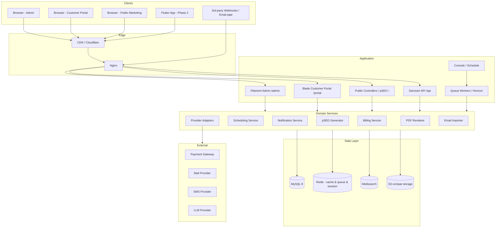
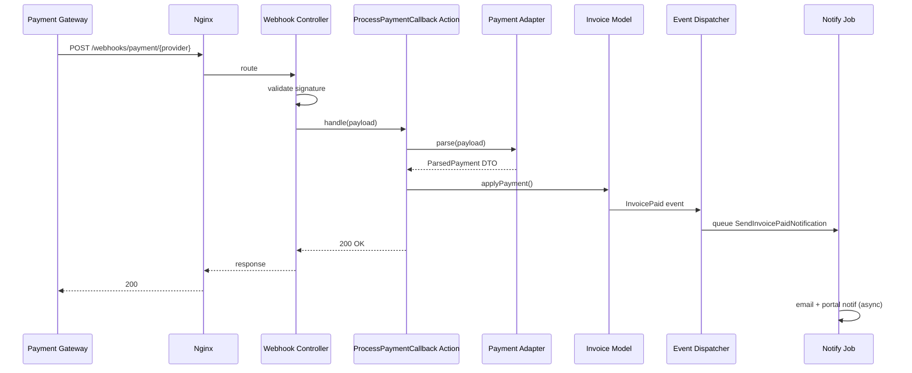

# 03 — System Architecture

**Project:** crmoffice
**Last updated:** 2026-05-30

---

## 1. Architecture Style

**Modular monolith** dengan **layered architecture** dan **domain-oriented namespacing**. Bukan microservices (over-engineering untuk MVP CRM). Bukan plain MVC tipis (terlalu thin untuk domain selevel ini).

**Technology Stack:** Laravel 13.7 + Filament 5 + Tailwind 4 + Vue 3 + Inertia 2

Prinsip:
- Controllers tipis — hanya HTTP plumbing
- Domain logic di Service / Action classes
- Persistence via Eloquent (tidak perlu repository abstraction sampai ada motivasi spesifik)
- Domain events untuk cross-module communication (Filament panel ↔ Customer portal ↔ API)
- Background work via queued Jobs (Horizon)
- Public boundary (controllers, console, jobs, events) di top, infra (cache, queue, DB, storage) di bottom

## 2. High-Level System Diagram



## 3. Layered Architecture

```
┌──────────────────────────────────────────────────────────┐
│ Presentation                                             │
│   Filament Resources · Inertia Controllers · API         │
│   Controllers · Blade views · Vue pages · Form Requests  │
├──────────────────────────────────────────────────────────┤
│ Application                                              │
│   Actions (single-purpose use cases) · DTOs · Policies   │
│   Domain Events · Listeners · Notifications              │
├──────────────────────────────────────────────────────────┤
│ Domain                                                   │
│   Models (Eloquent) · Value Objects · Domain Services    │
│   Domain Events                                          │
├──────────────────────────────────────────────────────────┤
│ Infrastructure                                           │
│   Provider Adapters (Payment / Mail / SMS / Storage /    │
│   LLM) · Search index sync · PDF renderer · Email pipe   │
│   parser · Webhook dispatcher · Job queue                │
└──────────────────────────────────────────────────────────┘
```

**Rules:**
- Presentation can call Application & Domain (read-only models OK), never Infrastructure directly
- Application orchestrates Domain + Infrastructure
- Domain knows nothing of HTTP, queue, or external services
- Infrastructure implements ports declared by Application

## 4. Request Lifecycle (Example: Mark Invoice Paid via Gateway Callback)



## 5. Folder Structure (Laravel)

```
crmoffice/
├── app/
│   ├── Console/
│   │   ├── Commands/                  # Artisan commands (import, recurring, dunning)
│   │   └── Kernel.php                  # Schedule
│   ├── Filament/
│   │   ├── Resources/                  # 35 resources in 9 navigation groups (Master Data, Penjualan, Finance, Operasional, Security, Laporan, Marketing, Integrasi, Sistem)
│   │   ├── Pages/                      # Custom pages: Dashboard, 6 Report pages (Sales, Leads, Project Profitability, Time Tracking, Tickets, Expense), Task Gantt Chart
│   │   ├── Widgets/                    # 7 dashboard widgets with per-role visibility (StatsOverview, RevenueChartWidget, RecentLeadsTable, PendingInvoicesTable, MyTasksTable, SupportQueueTable, AccountWidget)
│   │   └── Clusters/                   # Grouped resources (Sales cluster, etc.)
│   ├── Http/
│   │   ├── Controllers/
│   │   │   ├── Portal/                 # Blade controllers — customer portal (invoices, projects, tickets)
│   │   │   ├── Public/                 # Marketing + pSEO + public proposal/invoice
│   │   │   ├── Api/V1/                 # Sanctum API
│   │   │   └── Webhook/                # Inbound webhooks (payment, email)
│   │   ├── Middleware/
│   │   ├── Requests/                   # FormRequests for validation
│   │   └── Resources/                  # API resources (transformers)
│   ├── Models/                         # 56 Eloquent models
│   ├── Domain/
│   │   ├── Crm/                        # Clients, Leads, Contacts services
│   │   ├── Sales/                      # Estimate, Invoice, Payment services
│   │   ├── Projects/                   # Project, Task, Time services
│   │   ├── Support/                    # Ticket, KB services
│   │   ├── Platform/                   # Custom fields, audit, notification
│   │   └── Pseo/                       # Programmatic SEO generators
│   ├── Actions/                        # Single-purpose use case classes
│   │   ├── Crm/ConvertLeadToClient.php
│   │   ├── Sales/ConvertEstimateToInvoice.php
│   │   ├── Sales/GenerateRecurringInvoices.php
│   │   ├── Sales/ApplyPaymentToInvoice.php
│   │   ├── Projects/InvoiceTimeEntries.php
│   │   ├── Support/AssignTicketViaSlaPolicy.php
│   │   └── Support/PipeEmailToTicket.php
│   ├── Adapters/                       # Infrastructure adapters
│   │   ├── Payment/
│   │   │   ├── PaymentAdapterContract.php
│   │   │   ├── RedirectFlowAdapter.php
│   │   │   ├── EmbedFlowAdapter.php
│   │   │   └── QrFlowAdapter.php
│   │   ├── Mail/
│   │   │   ├── SmtpAdapter.php
│   │   │   └── RestApiAdapter.php
│   │   ├── Sms/
│   │   │   ├── RestSmsAdapter.php
│   │   │   └── SmppSmsAdapter.php
│   │   ├── Storage/
│   │   │   └── S3CompatibleAdapter.php
│   │   └── Llm/
│   │       ├── OpenAICompatibleAdapter.php
│   │       ├── AnthropicFormatAdapter.php
│   │       └── GeminiFormatAdapter.php
│   ├── Events/
│   ├── Listeners/
│   ├── Jobs/
│   ├── Notifications/
│   ├── Policies/
│   ├── Providers/
│   └── Support/                        # Helpers, traits, value objects
├── bootstrap/
├── config/
│   ├── crmoffice.php                   # App-specific config
│   ├── pseo.php                        # pSEO route catalog
│   └── ...
├── database/
│   ├── factories/
│   ├── migrations/                     # 63 migration files
│   └── seeders/
├── lang/
│   ├── en/
│   └── id/
├── resources/
│   ├── css/
│   │   └── filament/
│   │       └── admin/
│   │           └── theme.css            # Custom premium Filament theme (responsive, dark mode, glass topbar, gradient primary)
│   ├── js/
│   │   ├── Pages/                      # Vue 3 Inertia pages (public marketing + pSEO)
│   │   │   └── Public/                 # Marketing + pSEO pages
│   │   ├── Components/                 # Shared Vue components
│   │   ├── Layouts/
│   │   └── app.js
│   └── views/
│       ├── emails/                     # Mailables
│       ├── pdf/                        # PDF templates (invoice, proposal, contract)
│       ├── portal/                     # Customer portal Blade views
│       │   ├── invoices/
│       │   ├── projects/
│       │   └── tickets/
│       └── filament/                   # Filament view overrides
├── routes/
│   ├── web.php                         # Public + redirect to /admin or /portal
│   ├── portal.php                      # Customer portal (Blade)
│   ├── public.php                      # Marketing + pSEO + public links
│   ├── api.php                         # Sanctum API
│   ├── webhooks.php                    # Inbound webhooks
│   └── console.php
├── storage/
│   └── app/
│       ├── public/
│       ├── invoices/                   # Generated PDFs
│       ├── proposals/
│       └── provider-presets/           # JSON templates (autofill convenience)
├── tests/
│   ├── Feature/
│   ├── Unit/
│   └── Browser/                        # Pest/Dusk
└── composer.json
```

## 6. Service Boundaries

| Layer | Calls Into | Cannot Call |
|---|---|---|
| Filament Resource | Action, Service, Model | Adapter directly, Job::dispatch (use Action) |
| Inertia Controller | Action, Service, Model | Adapter directly |
| API Controller | Action, Service, Model (read-only via Resource transformer) | Other controllers, Filament |
| Action | Service, Model, Event dispatcher | HTTP request, Adapter directly (via Service) |
| Service | Model, Adapter (via interface), Repository (if any) | HTTP request, Console |
| Adapter | External HTTP, Config | Model (decouple from domain) |

## 7. Background Jobs

| Job | Queue | Trigger | Frequency |
|---|---|---|---|
| `GenerateRecurringInvoices` | `default` | Schedule | daily 00:30 |
| `SendInvoiceDueReminder` | `notifications` | Schedule | daily 08:00 |
| `SendInvoiceOverdueNotice` | `notifications` | Schedule | daily 09:00 |
| `RenderInvoicePdf` | `pdf` | Event `InvoiceCreated` / `InvoiceUpdated` | async |
| `SendInvoiceEmail` | `email` | Action `SendInvoice` | async |
| `PollEmailInboxForTicketReplies` | `support` | Schedule | every 2 min |
| `DispatchWebhookDelivery` | `webhooks` | Event subscriber | async + retry (5 attempts exponential) |
| `RebuildSearchIndex` | `search` | Model event observer | async batched |
| `RunSlaCheck` | `support` | Schedule | every 1 min |
| `CleanupOrphanFiles` | `default` | Schedule | weekly Sunday 03:00 |
| `RebuildPseoSitemap` | `default` | Schedule | hourly |
| `SendDailyDigestEmail` | `notifications` | Schedule | daily 07:00 |

**Worker pool config (`config/horizon.php`):**

```
production:
  supervisor-default: { queues: [default], processes: 3 }
  supervisor-email:   { queues: [email],   processes: 5 }
  supervisor-pdf:     { queues: [pdf],     processes: 2 }
  supervisor-search:  { queues: [search],  processes: 2 }
  supervisor-support: { queues: [support], processes: 2 }
  supervisor-notif:   { queues: [notifications], processes: 3 }
  supervisor-webhook: { queues: [webhooks], processes: 2 }
```

## 8. Caching Strategy

| Cached | Driver | TTL | Invalidation |
|---|---|---|---|
| Settings (KV table) | Redis | forever | on settings save |
| Currency rates | Redis | 6h | scheduled refresh |
| Tax rates | Redis | forever | on edit |
| User permissions | Redis | 1h | on role/permission change |
| Filament navigation badges | Redis | 60s | natural expiry |
| pSEO page HTML (full-page cache) | Redis | 24h | on data change → cache tag invalidate |
| Sitemap.xml | file | 1h | scheduled rebuild |
| Public KB pages | Redis | 1h | on article publish |

## 9. Search Strategy

**Meilisearch** indexes (per index name):

| Index | Searchable Attributes | Filterable | Sortable |
|---|---|---|---|
| `clients` | company_name, contacts.email | account_manager_id, status | created_at |
| `leads` | name, company, email, phone | lead_status_id, assigned_to, lead_source_id | last_activity_at |
| `invoices` | number, client_name | status, due_date | invoice_date |
| `projects` | name, description | status, client_id, project_manager_id | deadline |
| `tasks` | title, description | status, priority, assignee_id, project_id | due_date |
| `tickets` | number, subject, body | status_id, department_id, assigned_to | created_at |
| `kb_articles` | title, content | category_id, is_published | published_at |

Models implement Scout `Searchable` trait. Index sync via queued job.

## 10. File Storage

- **Default disk:** `local` (storage/app/private) untuk single-server install
- **Recommended production:** S3-compatible (config-driven; no provider name in code)
- All uploads via `App\Adapters\Storage\S3CompatibleAdapter` (which falls through to Laravel `Storage` facade)
- File metadata di table `files` (single table polymorphic: `attachable_type/id`)
- Signed temp URLs untuk private files (24h default)
- ClamAV scan opsional via queued job (config flag)

## 11. Session & Auth

- Session driver: **Redis**
- Web auth: standard Laravel auth (Filament + Inertia share guard `web`)
- Customer portal: separate guard `portal` (table `contacts`, password hash field)
- API: **Sanctum personal access token** untuk Flutter, **Sanctum SPA mode** untuk Inertia portal AJAX
- 2FA: TOTP via `pragmarx/google2fa-laravel` — optional staff, mandatory owner

## 12. Multi-Database / Read Replica

- `config/database.php` has `mysql` (write) and `mysql_read` (read)
- Heavy read queries (reports, dashboards) explicitly use `DB::connection('mysql_read')`
- Default connection writes through master
- Replica lag tolerance: 1s typical

## 13. Multi-Tenancy (Deferred, Phase 3)

Tidak di-build di MVP. Untuk Phase 3, opsi:
- **`stancl/tenancy`** dengan database-per-tenant (strong isolation, more ops cost)
- **Row-level tenant_id** + global scope (cheaper ops, weaker isolation)

Decision deferred. MVP single-tenant, tapi semua FK pattern tidak menghalangi future multi-tenant.

## 14. Observability

- **Logs:** Laravel `daily` channel; production opt-in untuk JSON output + ship ke Loki/CloudWatch
- **Errors:** Sentry (or compatible) — user pasang sendiri via `SENTRY_DSN`
- **Performance:** Laravel Telescope di local + staging; off di prod (or restricted)
- **Health endpoint:** `GET /healthz` — checks DB, Redis, Meilisearch, queue lag
- **Metrics:** Horizon dashboard untuk queue health; Filament widget untuk app KPIs

## 15. Deployment Targets (Documented, not built)

| Target | Notes |
|---|---|
| Laravel Forge | PHP 8.3, Nginx, MySQL 8, Redis, Horizon supervisord, scheduler cron |
| Ploi | Sama dengan Forge |
| Self-hosted Ubuntu 22.04 | docs/deploy/ubuntu.md (write in Phase 5) |
| Docker Compose | docker-compose.yml di repo root (Phase 5) — app + mysql + redis + meilisearch |

## 16. Anti-Patterns (Explicitly Avoided)

- ❌ Fat controllers — semua >10 LOC business logic ke Action/Service
- ❌ Hardcoded provider names di code (`MidtransAdapter`, `StripeAdapter`)
- ❌ Hardcoded credentials atau URL → semua via Provider model
- ❌ N+1 queries di Filament tables — selalu eager-load
- ❌ Sync external API calls dari HTTP request — semua via queue
- ❌ Plain text password storage anywhere
- ❌ Comments yang menjelaskan WHAT (cuma yang non-obvious WHY)
- ❌ Future-proofing yang tidak dibutuhkan MVP
